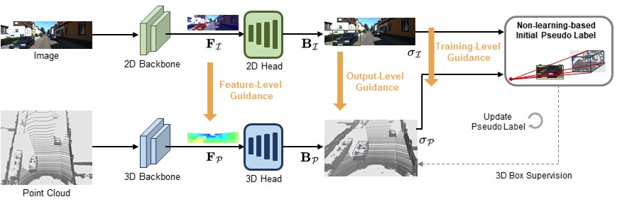

# VG-W3D
**[ECCV 2024] Weakly Supervised 3D Object Detection via Multi-Level Visual Guidance** [[paper](https://arxiv.org/abs/2312.07530)]\
**Authors**: [Kuan-Chih Huang](https://kuanchihhuang.github.io/), [Yi-Hsuan Tsai](https://sites.google.com/site/yihsuantsai/), [Ming-Hsuan Yang](https://faculty.ucmerced.edu/mhyang/).

## Introduction

Weakly supervised 3D object detection aims to learn a 3D detector with lower annotation cost, e.g., 2D labels. Unlike prior work which still relies on few accurate 3D annotations, we propose a framework to study how to leverage constraints between 2D and 3D domains without requiring any 3D labels. Specifically, we employ visual data from three perspectives to establish connections between 2D and 3D domains. First, we design a feature-level constraint to align LiDAR and image features based on object-aware regions. Second, the output-level constraint is developed to enforce the overlap between 2D and projected 3D box estimations. Finally, the training-level constraint is utilized by producing accurate and consistent 3D pseudo-labels that align with the visual data. 

## Usage
We only provide the sample code and data for different-level visual guidance for easy use.

For feature level:
```shell
python feature_level.py
```
For output level:
```shell
python output_level.py
```
For training level:
```shell
python training_level.py
```

### Citation
```
@inproceedings{huang2024vgw3d,
    author = {Kuan-Chih Huang and Yi-Hsuan Tsai and Ming-Hsuan Yang},
    title = {Weakly Supervised 3D Object Detection via Multi-Level Visual Guidance},
    booktitle = {ECCV},
    year = {2024}    
}
```
